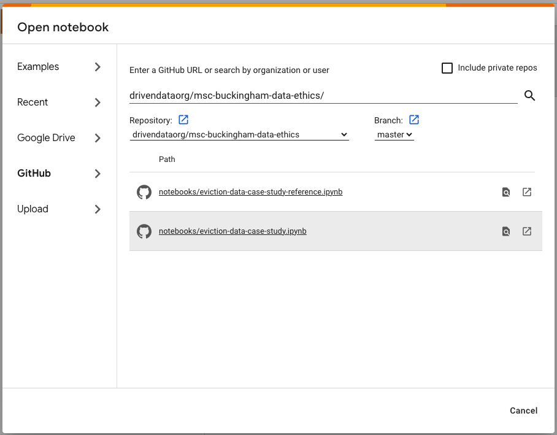

# Actionable Ethics for Data Scientists

Repository for the workshop given to MSc in applied data science students at the University of Buckingham in September 2023.

## Eviction data case study instructions

The eviction data case study is in a Jupyter notebook, `notebooks/eviction-data-case-study.ipynb`. **We encourage you to collaborate and work together throughout the exercise!**

There is a more comprehensive, completed version of the case study in [`notebooks/eviction-data-case-study-reference.ipynb`](https://github.com/drivendataorg/msc-buckingham-data-ethics/blob/master/notebooks/eviction-data-case-study-reference.ipynb). You can refer to it if you are stumped during any of the coding exercises, but we strongly encourage solving problems on your own first.

#### In Google colab

Google colab allows you to run the code online without any setup required on your computer.

1. Open [Google colab](https://research.google.com/colaboratory/) online
   
2. Load the case study notebook into Google colab directly from Github. Go to File > Open notebook, and select the “Github” tab on the left

3. Search for `drivendataorg/msc-buckingham-data-ethics/`. Then select the case study notebook, `notebooks/eviction-data-case-study.ipynb`



#### Locally

You can also run the case study notebook locally.

1. Open your terminal, and clone this repository into a folder in your current directory. This will create a folder called “msc-buckingham-data-ethics”
    ```shell
    git clone https://github.com/drivendataorg/msc-buckingham-data-ethics.git
    ```

2. Create a new environment to use for coding during the workshop.  If you don't already have conda, [install Miniconda](https://docs.conda.io/en/latest/miniconda.html) first.
   ```shell
   conda create --name msc-buckingham-data-ethics -y python=3.8
   ```

3. Activate the environment, and then install the necessary python packages using the requirements file in the repository. If you don't have `conda activate` set up, try `source activate msc-buckingham-data-ethics` instead.
    ```shell
    conda activate msc-buckingham-data-ethics
    cd msc-buckingham-data-ethics
    pip install -r requirements.txt
    ```

4. Launch a jupyter notebook with your `msc-buckingham-data-ethics` environment activated
   ```shell
   jupyter notebook
   ```

5. Open `notebooks/eviction-data-case-study.ipynb`

## About the workshop

This workshop presents an approach to data ethics based on integrating an ethics checklist into your existing data science workflow. We will use `deon` (http://deon.drivendata.org), a lightweight, open-source command line tool that outlines the key questions data scientists should consider at each stage of a project. We will explain the rationale behind building `deon`, consider real-world stories of ethical pitfalls, and then attendees will practice applying the principles of `deon` through discussion and an interactive coding exercise.

> Our goal is for every data scientist to practice data ethics as part of their regular work, so that we are all more intentional in our choices and more aware of their ethical implications.

Come learn how to jumpstart the ethics conversations that all data science teams should be having.

### Key takeaways

- There is no one right answer. Tradeoffs are inevitable and reasonable people can disagree. Tradeoff calculations will depend on your specific use case and context.
- Ethics need to be actively considered throughout a project, not just at the beginning.
- Good intention are not enough. To minimize the risk of harm, you have to intentionally consider possible consequences.
- A model trained on data from a world with inequality will likely learn to be unequal.

### About `deon`

<a href="http://deon.drivendata.org/"></a>

`deon` (http://deon.drivendata.org) is a lightweight, open-source command line tool designed to easily create and incorporate an ethics checklist into your work. The goal is to enable teams to flexibly carry out the ethical discussions most relevant to them, and to preemptively address issues they may otherwise overlook. 

There has been much ongoing reflection and dialogue within the data science profession about what ethical principles to abide by, especially in the form of ethical codes and oaths. However, there is often still a gap between those principles and the day-to-day work of data scientists—tenets are either too abstract or too rigid to apply readily. `deon` and the checklist framework we present encourages an upfront and ongoing dialogue about the different ethical aspects of your project. By closely integrating data ethics into an ongoing workflow, we as data scientists can cultivate ethical intentionality in our work.

- Checklists connect principle to practice and enable data scientists to exercise their data ethics muscles, becoming better at issue-spotting, mitigation, and navigating subtle discussions.
- Having a structured process for data ethics makes it easier for teams to have tough conversations and helps ensure that important work doesn't get overlooked.
- Working through the ethics checklist in `deon` can help preempt ethical problems down the line.

### Target audience

This workshop is intended for data scientists and managers—the practitioners that have influence over how data science gets done. This means anyone who spends their days working directly with data, in the realm of data collection, data storage, analysis, modeling and/or deployment.